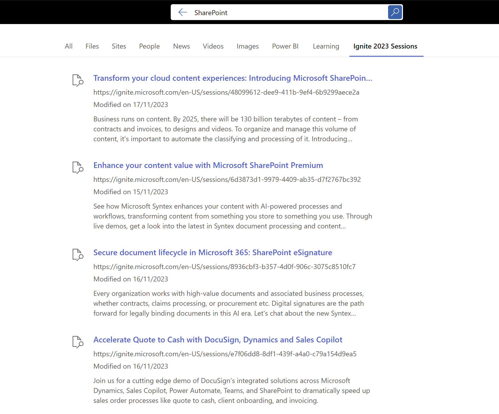

# Ingest local json content using PowerShell using Ignite sessions as a example

## Summary

This samples contains a Microsoft Graph connector built in PowerShell that shows how to ingest local json content. Each session is a row of data, mapped to external connection's schema based on the metadata from the JSON file. The ingested content is set to be visible to everyone in the organization.



# Graph connector to import markdown files into the Graph

This uses the sample from PnP Graph connectors as a basis for importing the content into the Graph. The original sample is here:
https://github.com/pnp/graph-connectors-samples/tree/main/samples/powershell-markdown

## Contributors

- [Paul Bullock](https://twitter.com/pkbullock)

## Version history

Version|Date|Comments
-------|----|--------
1.0|November 23, 2023|Initial release

## Prerequisites

- [Microsoft 365 Developer tenant](https://developer.microsoft.com/microsoft-365/dev-program)
- [Microsoft Graph PowerShell SDK](https://learn.microsoft.com/powershell/microsoftgraph/installation?view=graph-powershell-1.0)
- [Microsoft.PowerShell.SecretManagement](https://learn.microsoft.com/en-us/powershell/module/microsoft.powershell.secretmanagement/?view=ps-modules)
- [Microsoft.PowerShell.SecretStore](https://learn.microsoft.com/powershell/module/microsoft.powershell.secretstore/?view=ps-modules)

> Note, this used Microsoft Graph PowerShell 2.9.1

## Minimal path to awesome

- Follow the script:

    ```powershell
    # Ensure you've got a default secret store configured, by running
    Get-SecretVault
    # If nothing shows up, run
    Register-SecretVault -Name LocalStore -ModuleName Microsoft.PowerShell.SecretStore -DefaultVault
    # Run setup, also contains the configuration settings
    .\Setup-GraphConnector.ps1
    ```

`Functions.ps1` contains supporting functions for the script, no changes are needed here to make the sample your own.

- [Create result type](https://learn.microsoft.com/microsoftsearch/manage-result-types) with default settings and the external connection you've just created
- Use the `resultLayout.json` file for the Adaptive Card code

## Features

The sample illustrates the following concepts:

- script creating the Entra (Azure AD) app registration using the Microsoft Graph SDK
- create external connection including URL to item resolver to track activity when users share external links
- create external connection schema
- ingest metadata from the ignite-session.json file into search
- visualize the external content in search results using a custom Adaptive Card

## Disclaimer

**THIS CODE IS PROVIDED *AS IS* WITHOUT WARRANTY OF ANY KIND, EITHER EXPRESS OR IMPLIED, INCLUDING ANY IMPLIED WARRANTIES OF FITNESS FOR A PARTICULAR PURPOSE, MERCHANTABILITY, OR NON-INFRINGEMENT.**


